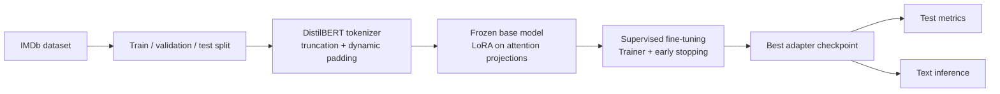

# Parameter-Efficient LLM Fine-Tuning with LoRA

**About:** A reproducible supervised fine-tuning pipeline that adapts DistilBERT to IMDb sentiment classification using Hugging Face Datasets, Transformers, PyTorch, and PEFT/LoRA.

## Overview

This repository implements the full workflow around a task-specific language-model adaptation: load a public text dataset, create a reproducible validation split, tokenize with the pretrained model's tokenizer, attach a LoRA adapter, fine-tune with the Hugging Face Trainer, evaluate on an untouched test set, and run inference from the saved adapter.

The example uses `distilbert-base-uncased` and the IMDb movie-review dataset. It is a supervised fine-tuning project for sequence classification rather than a from-scratch language-model pretraining or chat-model instruction-tuning project. That distinction keeps the experiment runnable while demonstrating the core mechanics used in larger LLM adaptation systems.

## What the project demonstrates

- Building a reproducible dataset-to-model training pipeline.
- Using parameter-efficient fine-tuning instead of updating every base-model weight.
- Selecting a validation model checkpoint by task quality rather than training loss alone.
- Preserving the classification head when saving a LoRA adapter.
- Evaluating with accuracy, precision, recall, and F1 on a separate test split.
- Loading the resulting adapter for application-style inference.
- Supporting small sample limits for fast development and CI smoke runs.

## Pipeline



## Technology stack

| Area | Tools | Role |
| --- | --- | --- |
| Runtime | Python 3.10+ | Project runtime and packaging |
| Deep learning | PyTorch | Tensors, model execution, and hardware acceleration |
| Model and training APIs | Hugging Face Transformers | Pretrained model, tokenizer, Trainer, and training arguments |
| Dataset processing | Hugging Face Datasets | Downloading, splitting, shuffling, mapping, and column management |
| Parameter-efficient fine-tuning | PEFT | LoRA configuration, adapter injection, and adapter loading |
| Metrics | scikit-learn | Accuracy, precision, recall, and F1 |
| Testing | pytest and GitHub Actions | Unit tests and automated checks |

## Data preparation

`src/fine_tuning_llms/data.py` keeps dataset logic separate from model training.

1. The IMDb dataset is loaded from the Hugging Face Hub.
2. When no validation split exists, the original training split is divided into train and validation partitions with a fixed seed and label stratification.
3. Optional sample limits shuffle each partition before selecting rows, which makes small development runs less sensitive to dataset ordering.
4. The text and integer label columns are validated before tokenization.
5. The pretrained tokenizer applies truncation to `--max-length`; `DataCollatorWithPadding` applies batch-level dynamic padding during training.

The test split is not used for training or checkpoint selection. It is evaluated only after the best validation checkpoint has been restored.

## LoRA fine-tuning design

The base DistilBERT weights remain frozen while trainable low-rank updates are inserted into the attention query and value projections (`q_lin` and `v_lin`). The default adapter uses:

- LoRA rank `r = 8`
- LoRA scaling `alpha = 16`
- LoRA dropout `0.10`
- `bias="none"`
- the `pre_classifier` and `classifier` modules saved as trainable task-specific weights

The classifier head matters here because the pretrained DistilBERT checkpoint does not contain an IMDb-specific classification head. Saving it with the adapter ensures that loading the fine-tuned artifact restores both the LoRA updates and the task head. In the default configuration, only about 1% of the model parameters are trainable.

This is the practical LoRA idea: instead of learning a full update to every parameter matrix, the training process learns a small low-rank update that is added to selected frozen layers. The resulting artifact is much smaller than a full model copy and is easier to compare, store, and deploy.

## Training and evaluation

The training stage uses `transformers.Trainer` with:

- AdamW optimization through the Transformers training stack
- learning rate `2e-4`
- weight decay `0.01`
- a `0.10` warmup ratio
- gradient accumulation over two batches
- validation and checkpointing at the end of each epoch
- best-checkpoint restoration using validation F1
- early stopping after two validation evaluations without improvement

The test report contains accuracy, precision, recall, F1, loss, runtime, and throughput. F1 is used for checkpoint selection because it gives a more useful view than accuracy alone when the class distribution or error costs are not perfectly symmetric.

## Quick start

```bash
git clone https://github.com/amir-sbg/fine-tuning-LLMs.git
cd fine-tuning-LLMs

python -m venv .venv
source .venv/bin/activate       # Windows: .venv\Scripts\activate
python -m pip install -r requirements.txt
python -m pip install -e .
python -m pytest -q
```

Run the default IMDb fine-tuning pipeline:

```bash
python -m fine_tuning_llms.pipeline
```

The default run uses the complete IMDb train and test splits. For a quick local smoke run:

```bash
python -m fine_tuning_llms.pipeline \
  --max-train-samples 256 \
  --max-validation-samples 64 \
  --max-test-samples 64 \
  --epochs 1 \
  --max-length 128 \
  --output-dir artifacts/imdb-smoke \
  --report-dir reports/imdb-smoke
```

All important training controls are exposed as command-line options, including model name, sequence length, learning rate, batch sizes, gradient accumulation, LoRA rank, validation size, seed, and sample limits. The exact configuration is written to `reports/run_config.json`.

## Inference

After training, load the saved adapter and classify one or more reviews:

```bash
python -m fine_tuning_llms.inference \
  --adapter-dir artifacts/imdb-distilbert-lora \
  --text "A thoughtful, well-acted film with a strong ending." \
        "The story was slow and difficult to follow." \
  --device auto
```

The inference command loads the tokenizer and PEFT adapter, selects CUDA, Apple MPS, or CPU when `--device auto` is used, and returns a label with the model's highest-class confidence.

## Outputs

```text
artifacts/imdb-distilbert-lora/
├── adapter_config.json
├── adapter_model.safetensors
├── config.json
├── tokenizer.json
└── tokenizer_config.json

reports/
├── dataset_sizes.json
├── run_config.json
├── run_summary.json
└── test_metrics.json
```

The generated model directory contains the adapter and task-specific classifier weights. The base DistilBERT checkpoint is downloaded by Transformers and is intentionally not copied into the repository or adapter artifact.

## Project structure

```text
.
├── .github/workflows/ci.yml
├── src/fine_tuning_llms/
│   ├── config.py       # validated fine-tuning configuration
│   ├── data.py         # dataset loading, validation, limits, tokenization
│   ├── model.py        # tokenizer and LoRA model construction
│   ├── train.py        # Trainer and checkpointing configuration
│   ├── evaluate.py     # metrics and test-set reporting
│   ├── inference.py    # loading adapters and predicting text labels
│   └── pipeline.py     # command-line orchestration
├── tests/
│   └── test_pipeline.py
├── Makefile
├── pyproject.toml
├── requirements.txt
└── README.md
```

## Reproducibility and limitations

The pipeline seeds the Hugging Face, Python, NumPy, and PyTorch components through the Transformers seed utility and records the run configuration. Exact bit-for-bit reproducibility can still vary across hardware backends and library versions.

This repository is intentionally a focused portfolio implementation. It does not claim that a single IMDb run is a production-quality sentiment system, and it does not fine-tune a generative chat model. A natural next step would be to add experiment tracking, calibration analysis, model-card metadata, and a causal language-model instruction-tuning example using the same dataset/configuration patterns.
